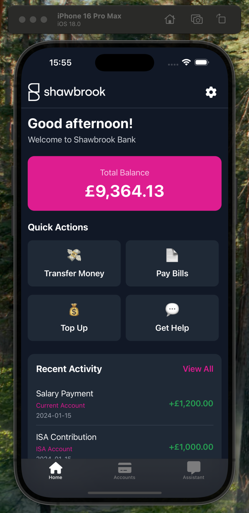

# Shawbrook Mini Banking App



A React Native mobile banking application built with Expo, featuring biometric authentication, account management, and an AI-powered chatbot.

## Features

- **Biometric Authentication**: TouchID/FaceID login with PIN fallback
- **Account Dashboard**: View account balances and details
- **Account Details**: Transaction history and transfer options
- **AI Chatbot**: Banking assistant powered by OpenAI
- **Dark/Light Mode**: Theme switching support
- **Secure Storage**: Encrypted session management

## Tech Stack

- **React Native** with Expo Router
- **TypeScript** for type safety
- **NativeWind** (Tailwind CSS) for styling
- **React Context API** for state management
- **Expo Local Authentication** for biometrics
- **OpenAI API** for chatbot functionality
- **Expo Secure Store** for secure storage

## Setup

1. **Install dependencies**
   ```bash
   pnpm install
   ```

2. **Environment setup**
   
   Set FontAwesome token in your shell:
   ```bash
   export FONTAWESOME_NPM_AUTH_TOKEN=your_fontawesome_token_here
   ```
   
   Create a `.env` file in the root directory:
   ```
   EXPO_PUBLIC_OPENAI_API_KEY=your_openai_api_key_here
   ```

3. **Start the app**
   ```bash
   pnpm start
   ```

4. **Run on device/simulator**
   - iOS: `pnpm run ios`
   - Android: `pnpm run android`
   - Web: `pnpm run web`

## Architecture

- **File-based routing** with Expo Router
- **Context providers** for auth, chat, and theme state
- **Service layer** for API calls and secure storage
- **Component-based UI** with reusable components
- **Mock data** for accounts and transactions

## Optional Features Implemented

- ✅ Dark/light mode support
- ✅ TypeScript configuration and ESLint setup

## Future Improvements

### Code Quality & Development Experience
- **Enhanced ESLint/TypeScript**: Stricter ESLint rules, better TypeScript checking, and commit hooks with Husky
- **Prettier**: Code formatting with `pnpm format` command
- **Testing**: React Native Testing Library for unit tests, Maestro for E2E testing
- **Storybook**: Component documentation and testing

### Security & Performance
- **Sentry Crashalytics**: Error tracking and crash reporting
- **Performance Monitoring**: React Native Performance, memory optimization
- **Code Optimization**: Strategic use of `useCallback`, `useMemo`, and `React.memo` for performance
- **Memory Optimization**: Image optimization, list virtualization

### User Experience
- **Offline Support**: Service workers, cached data
- **Push Notifications**: Transaction alerts, security notifications
- **Accessibility**: Screen reader support, voice commands
- **Internationalization**: Multi-language support, RTL layouts

### Production Features
- **Real API Integration**: Replace mock data with actual banking APIs
- **Analytics**: PostHog for user behavior tracking and product analytics
- **A/B Testing**: Feature flags, gradual rollouts
- **CI/CD**: GitHub Actions or Expo Workflows for automated testing and deployment
- **App Store Deployment**: 
  - iOS: Apple App Store and TestFlight setup
  - Android: Google Play Store setup
  - EAS Build profiles in `eas.json` for different environments (development, staging, production)

## Notes

- Uses mock account data for demonstration
- Biometric authentication requires device support
- OpenAI API key needed for full chatbot functionality
- Fallback responses available when API is unavailable
